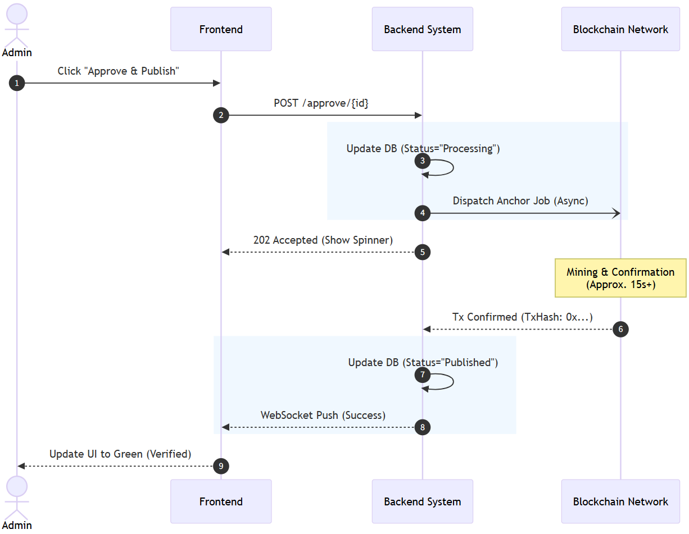

# Strategic Research Nexus (SRN) - Hybrid Web3 Backend


> **Strategic Research Nexus (SRN)** is an independent academic platform that connects Afghan researchers worldwide, bridges academic divides to foster interdisciplinary collaboration, and advances evidence-based research for Afghanistan's sustainable development.

## Overview

This project is designed to replace traditional, centralized academic repositories with a transparent and tamper-proof system. By leveraging a **Hybrid Storage Architecture**, the system combines the high-throughput performance of traditional relational databases with the trustless verification of blockchain technology.

* **Off-chain (Performance Layer):** Structured metadata, heavy PDF files, and user profiles are managed in **PostgreSQL** (via Neon Serverless).
* **On-chain (Verification Layer):** A unique 32-byte cryptographic fingerprint (SHA-256 Hash) of every uploaded research artifact is selectively anchored to an **Ethereum** smart contract.

This architecture ensures that while file retrieval remains synchronous and efficient, the integrity of every research paper is mathematically verifiable on the public ledger without incurring exorbitant Gas fees.

[**Live Demo**](https://srn-esg8b4gsfrhne4dj.germanywestcentral-01.azurewebsites.net/) | [**Etherscan Contract**](#) *(Add your contract link here)*

---

## Key Features

### Core Functionality
* **Blockchain Anchoring (Proof of Existence):**
    * Utilizes `Nethereum` to securely sign and dispatch transactions to the Ethereum network.
    * Implements a gas-efficient **"Hash-Only"** storage strategy, minimizing the state footprint on-chain.
* **Tamper-Evident Verification:**
    * Automatically re-hashes stored documents and compares them against the immutable Ethereum registry, mathematically proving data integrity.
* **Asynchronous UX Optimization (SignalR):**
    * Integrated **WebSocket (SignalR)** feedback loops to mask the inherent 12-15 second mining delay of the Ethereum network. Clients are notified instantly upon successful block confirmation.

### Architecture & Engineering
* **Clean Architecture:** Strict separation of concerns across `Domain` (Entities) ← `Application` (Use Cases) ← `Infrastructure` (External Services) ← `API` (Entry Point).
* **Custodial Wallet Model:** Abstracted Web3 complexities (MetaMask, Private Keys, Gas fees) away from non-technical researchers.
* **Security:** ASP.NET Core Identity paired with **JWT Authentication** and Role-Based Access Control (RBAC).

---

## Tech Stack

| Category | Technology | Description |
| :--- | :--- | :--- |
| **Framework** | .NET 8 (C#) | High-performance RESTful Web API |
| **Architecture**| Clean Architecture | Domain-Driven Design (DDD) principles |
| **Database** | PostgreSQL | Managed via Neon (Serverless) |
| **ORM** | EF Core 8 | Code-First migrations with Npgsql |
| **Blockchain** | Ethereum / Solidity | Smart Contract for immutable asset registry |
| **Integration** | Nethereum | .NET integration middleware for Ethereum RPC |
| **Real-time** | SignalR | Native bi-directional WebSocket communication |
| **Cloud** | Azure App Service | CI/CD deployment environment (Linux) |

---

## System Architecture

*(The system enforces a strict separation of state management and trust verification.)*


## Anchoring Sequence (Latency Mitigation)

*(Demonstrating the event-driven workflow that prevents UI blocking during Ethereum block mining.)*



---

## Project Structure

The solution is organized into four distinct layers:

1. **`SRN.Domain`:** Contains Enterprise Logic, Entities (`Artifact`, `ApplicationUser`), and Repository Interfaces. Zero external dependencies.
2. **`SRN.Application`:** Contains Business Logic (DTOs, Services Interfaces) and orchestrates the application state.
3. **`SRN.Infrastructure`:** Implements data persistence (`ApplicationDbContext`), external Web3 communication (`EthereumBlockchainService`), and WebSocket hubs.
4. **`SRN.API`:** The presentation layer containing REST Controllers, JWT Middleware, and Swagger configurations.

---

## Getting Started

### Prerequisites
* [.NET 8.0 SDK](https://dotnet.microsoft.com/download)
* PostgreSQL (Local installation or Cloud connection string like Neon/Supabase)
* Ethereum Wallet Private Key with Testnet ETH (e.g., Sepolia)
* Infura or Alchemy RPC Endpoint

### Installation

1. **Clone the repository**
   ```bash
   git clone https://github.com/TianxingFan/SRN-Backend.git
   cd SRN-Backend/SRN.API
   ```

2. **Configure Environment**
   Create an `appsettings.json` file in the `SRN.API` directory. *Note: For production, use User Secrets or Environment Variables.*

   ```json
   {
     "Logging": {
       "LogLevel": {
         "Default": "Information",
         "Microsoft.AspNetCore": "Warning"
       }
     },
     "AllowedHosts": "*",
     "ConnectionStrings": {
       "DefaultConnection": "Host=localhost;Port=5432;Database=Your_DB;Username=postgres;Password=Your_Password"
     },
     "JwtSettings": {
       "Key": "Your_Super_Secret_Key_At_Least_32_Chars_Long",
       "Issuer": "SRN.API",
       "Audience": "SRN.Client",
       "DurationInMinutes": 60
     },
     "Blockchain": {
       "RpcUrl": "https://sepolia.infura.io/v3/YOUR_INFURA_KEY",
       "PrivateKey": "YOUR_WALLET_PRIVATE_KEY",
       "ContractAddress": "0xYOUR_SMART_CONTRACT_ADDRESS"
     }
   }
   ```

3. **Run EF Core Migrations**
   Apply the migrations to initialize the database schema.
   ```bash
   dotnet ef database update --project ../SRN.Infrastructure --startup-project .
   ```

4. **Start the Server**
   ```bash
   dotnet run
   ```

---

## Smart Contract Interaction snippet

The core anchoring logic within `EthereumBlockchainService.cs`. The system registers only the SHA-256 hash, rather than raw document data, preserving block space and maximizing cost-efficiency.

```csharp
public async Task<string> RegisterArtifactAsync(string fileHash)
{
    var contract = _web3.Eth.GetContract(_abi, _contractAddress);
    var registerFunction = contract.GetFunction("registerArtifact");

    // Cryptographic hash payload
    var hashBytes = fileHash.HexToByteArray();
    
    // Dispatch transaction to Ethereum network
    var receipt = await registerFunction.SendTransactionAsync(
        _web3.TransactionManager.Account.Address,
        new HexBigInteger(400000), // Gas Limit
        new HexBigInteger(0),      // Msg.Value
        hashBytes
    );
    
    return receipt;
}
```

---

## Deployment

* **CI/CD:** Automated build and seamless deployment integrated via GitHub Actions.
* **Platform:** Microsoft Azure App Service (Linux Environment).
* **State Management:** Neon Serverless PostgreSQL.
