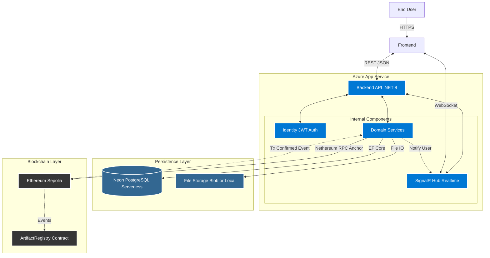
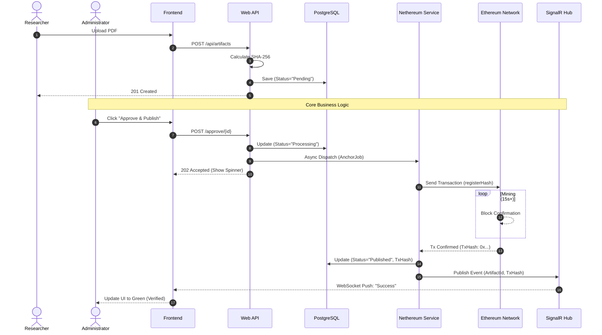

# SRN Backend

> **Strategic Research Nexus (SRN)** is an independent academic platform that connects Afghan researchers worldwide, bridges academic divides to foster interdisciplinary collaboration, and advances evidence-based research for Afghanistan's sustainable development.
> 
## Overview

This project is designed to replace traditional, centralized academic repositories with a transparent and tamper-proof system. By leveraging **Hybrid Storage Architecture**, the system combines the speed of traditional databases with the trustlessness of blockchain technology.

* **Off-chain:** Structured metadata and user profiles are managed in **PostgreSQL** (via Neon Serverless).
* **On-chain:** A unique cryptographic fingerprint (SHA-256 Hash) of every uploaded artifact is anchored to the **Ethereum** blockchain smart contract.

This architecture ensures that while file retrieval is fast and efficient, the integrity of the research paper is mathematically verifiable on the public ledger.

[**Live Demo**](https://srn-esg8b4gsfrhne4dj.germanywestcentral-01.azurewebsites.net/) | [**API Documentation**](#api-documentation)

---

## Key Features

### Core Functionality
* **Blockchain Anchoring (Proof of Existence):**
    * Utilizes `Nethereum` to interact with Ethereum smart contracts.
    * Implements a gas-efficient **"Hash-Only"** storage strategy (storing only the file fingerprint, not the file itself).
* **Tamper Verification:**
    * Provides a dedicated verification endpoint. The system re-hashes the stored file and compares it against the immutable record on the blockchain.
* **Real-time Notifications:**
    * Integrated **SignalR** to handle asynchronous blockchain transaction confirmations, notifying the client immediately when an artifact is successfully mined/anchored.

### Architecture & Engineering
* **Clean Architecture:**
    * Strict separation of concerns: `Domain` (Entities) ← `Application` (Use Cases) ← `Infrastructure` (External Services) ← `API` (Entry Point).
* **Cloud-Native Database:**
    * Built on **Neon Serverless PostgreSQL** to handle the variable traffic load typical of academic research platforms.
* **Security:**
    * ASP.NET Core Identity with **JWT Authentication** for secure access control.

---

## Tech Stack

| Category | Technology | Description |
| :--- | :--- | :--- |
| **Framework** | .NET 8 (C#) | High-performance Web API |
| **Architecture** | Clean Architecture | Domain-Driven Design (DDD) principles |
| **Database** | PostgreSQL | Managed via Neon (Serverless) |
| **ORM** | EF Core 8 | Code-First migrations with Npgsql |
| **Blockchain** | Ethereum / Solidity | Smart Contract for asset registry |
| **Integration** | Nethereum | .NET integration library for Ethereum |
| **Real-time** | SignalR | WebSocket-based real-time updates |
| **Cloud** | Azure App Service | CI/CD deployment target |

---

## System Architecture



## Sequence Diagram



The solution is organized into four distinct layers:

1.  **SRN.Domain:** Contains Enterprise Logic, Entities (`Artifact`, `ApplicationUser`), and Repository Interfaces. No external dependencies.
2.  **SRN.Application:** Contains Business Logic (DTOs, Services Interfaces). Orchestrates the flow of data.
3.  **SRN.Infrastructure:** Implements interfaces. Handles Database context (`ApplicationDbContext`), Blockchain interaction (`EthereumBlockchainService`), and File I/O.
4.  **SRN.API:** The presentation layer containing Controllers and Middleware.

---

## Getting Started

### Prerequisites
* [.NET 8.0 SDK](https://dotnet.microsoft.com/download)
* PostgreSQL (Local or Cloud connection string)
* Ethereum Wallet Private Key (Testnet recommended, e.g., Sepolia)

### Installation

1.  **Clone the repository**
    ```bash
    git clone https://github.com/TianxingFan/SRN-Backend.git
    cd SRN_Backend/SRN.API
    ```

2.  **Configure Environment**
    Creat `appsettings.json` as following and replace the the information to yours.

    ```json
    {
    "Logging": {},
    "AllowedHosts": "*",
    "ConnectionStrings": {
      "DefaultConnection": "Host=localhost;Port=5432;Database=Your_Database_Name;Username=postgres;Password=Your_Password"
    },
    "JwtSettings": {
      "Key": "Your_Key_AtLeast32Chars",
      "Issuer": "SRN.API",
      "Audience": "SRN.Client",
      "DurationInMinutes": 60
    },
    "Blockchain": {
      "Provider": "Mock", //or Real if you have a wallet.
      "RpcUrl": "",
      "PrivateKey": "",
      "ContractAddress": ""
      }
    }
    ```

3.  **Run Migrations**
    Apply the EF Core migrations to initialize the database schema.
    ```bash
    dotnet ef database update --project SRN.Infrastructure --startup-project SRN.API
    ```

4.  **Start the Server**
    ```bash
    dotnet run --project SRN.API
    ```

---

## Smart Contract Interaction

The core anchoring logic is handled in `EthereumBlockchainService.cs`. The backend does not store the file content on-chain to save costs; instead, it registers the hash.

```csharp
// Example: Anchoring an artifact hash to Ethereum
public async Task<string> RegisterArtifactAsync(string fileHash)
{
    var contract = _web3.Eth.GetContract(_abi, _contractAddress);
    var registerFunction = contract.GetFunction("registerArtifact");

    // Transaction sent to the network
    var receipt = await registerFunction.SendTransactionAsync(
        _web3.TransactionManager.Account.Address,
        new HexBigInteger(400000), 
        new HexBigInteger(0), 
        fileHash.HexToByteArray()
    );
    return receipt;
}
```

---

### Deployment

* **CI/CD:** Automated build and deployment via GitHub Actions.

* **Platform:** Azure App Service (Linux Environment).

* **Data:** Neon Serverless PostgreSQL.
